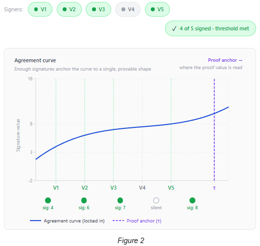

## Abstract

This CHIP defines a standard to enable a scalable voting mechanism on the Chia Blockchain that could achieve the goal of 20,000+ voters.

This is based on the DIG Networks L2 consensus architecture at [https://github.com/DIG-Network/chia-l2-consensus](https://github.com/DIG-Network/chia-l2-consensus) however the CHIP has been generalized to describe a wider set of use cases.

We achieve this using the following components:

1. An **Election Singleton** that is the canonical **system orchestrator** for the deployment. Its sole responsibilities are gating **voter registration**, issuing **ballots** via **`createBallot`**, and authorizing **voter deregistration / collateral release**. It is **NOT** the vote finalizer; election mechanics (vote tally, finalize, oracle attestations) live on the **Ballot Coin**. Each singleton inner action is dispatched through the standard CHIP-0050 **action-layer puzzle**.

2. A **Registration Coin** created by spending the Election Singleton **once per voter**. It stakes the voter's CAT for the lifetime of that registration (until release rules allow withdrawal). Successful registration enrols that voter in **every ballot** minted while the registration remains active—it does **not** carry the substantive vote intent for specific ballots.

3. A **Ballot Coin** created solely by an Election Singleton **`createBallot`** action. It carries ballot identity (`ballot_launcher_id` lineage), temporal bounds (when voting ends / when finalize may run), the outcome namespace, the Groth16 VK/IC pinned at deploy, the threshold pack, and any ballot-specific policy the deployment curries. The Ballot Coin is the **vote finalizer** for its own ballot via its **`finalize`** action (Groth16 + `bls_verify`). It also exposes a per-ballot **`oracle`** action that emits state announcements consumed by Voting Coin edits. **No voter registration spend is required to vote**; votes are not serialized through the singleton.

4. A **Voting Coin** created from the **Registration Coin** when the voter casts a vote for a **specific ballot**. Its curried state binds **`ballot_launcher_id`**, **`vote_data`**, and the voter identity needed for aggregation. The Registration Coin enforces **at most one Voting Coin lineage per ballot** (one effective vote slot per voter per ballot) via a per-registration small SPT keyed by `ballot_launcher_id`. The Voting Coin's owner may **re-spend to change `vote_data`** until the Ballot Coin's rules say the ballot has ended; mid-ballot edits MUST co-spend the Ballot Coin's `oracle` action (the singleton is **not** involved). After ballot end, the vote is frozen for aggregation and finalize.

The lineage proof between the Registration Coin and its parent Election Singleton spend is what makes registration legitimate. A vote for a ballot is legitimate because (a) the Voting Coin's creation was authorized by a Registration Coin that proves SPT membership and single-use-per-ballot, (b) the Voting Coin puzzle binds the ballot launcher and vote payload, and (c) the voter's BLS signature over the canonical **`vote_message`** for that ballot is carried for off-chain aggregation (e.g. in memos on the spend that creates or updates the Voting Coin), with **`bls_verify`** checked on Ballot Coin finalize together with Groth16.

Vote aggregating parties verify registration lineage and ballot membership before building proofs. Vote finalization is achieved by aggregating votes into a Groth16 circuit off-chain to generate a ZK proof that commits a configurable **weighted** threshold of registered vote weight backed by an aggregated BLS signature for a canonical **`vote_message`** (paired with **`bls_verify`** on-chain at Ballot Coin finalize).

CLVM currently has all the required opcodes to verify a Groth16 circuit proof.

## Motivation

**The Problem**

Chia needs a standard for scalable voting. A naïve pattern ties **every vote** to a **Singleton** spend, which serializes voter actions to roughly **one meaningful update per block** on that singleton's lane—the "single parallelism problem." Replace-By-Fee and action-layer tricks help at small scale but do not fix large, decentralized tallies.

**Singleton bottleneck: register once, vote in parallel**

**Registration** still spends the Election Singleton (SPT insert, collateral binding). That path is **intentionally singleton-bound**: at most one new registration per block for a given election, which is acceptable because registration is a **one-time (per enrollment) setup** and is not latency-critical.

**Voting** must **not** spend the Election Singleton. If every vote required a singleton spend, then even with async finalization the system would still behave like **one vote per block** whenever voters must register-and-vote in lockstep. Finalization must **not** spend the Election Singleton either: it spends the Ballot Coin, freeing the singleton's lane for orchestration (registrations, new ballots, deregistrations).

This CHIP separates:

* **Enrollment** — slow lane, singleton, once per voter while they keep collateral staked.

* **Ballot issuance** — slow lane, singleton's **`createBallot`** action; each ballot defines a logically distinct question or round.

* **Deregistration / release** — slow lane, singleton's **`deregister`** action authorizes the Registration Coin to unlock its collateral.

* **Votes** — fast lane: Registration Coin spends that **mint or update Voting Coins** scoped to a ballot launcher. Many voters can advance different Voting Coins **in parallel** in the same block (subject only to mempool and chain limits), because they do not contend on the singleton.

* **Finalize / ballot oracle** — Ballot Coin lane: each ballot finalizes independently, never on the singleton.

**Why the Election Singleton Matters**

Without a canonical orchestrator, anyone could wrap a rogue coin as a phony voter or fake ballot. The Election Singleton gates **who counts** in the SPT, binds ballot issuance via `createBallot`, and authorizes collateral release via `deregister`. **`createBallot`** is the only way to obtain a legitimate Ballot Coin lineage for proofs and finalize checks.

**Why the Registration Coin Matters**

It holds escrowed CAT under election policy and proves SPT enrollment. Enumerating registration coins still supports witness construction for Groth16; **per-ballot votes** are enumerated via **Voting Coins** keyed to **`ballot_launcher_id`** (and puzzles / hints as specified in implementations).

**Why the Ballot Coin Matters**

It encapsulates the entire mechanics of a single election round: timing, finalize authority, oracle attestation. Each ballot finalizes on its own coin, so ballots are independent and the singleton's lane is reserved for orchestration only.

**Why Groth16**

Groth16 is the most efficient proof system for on-chain verification: constant-size proof (three curve points), verification with operations already available via CHIP-0011.

**Technical Feasiblity**

All operators needed for Groth16 verification already exist in CLVM as of CHIP-0011. This CHIP requires no changes to the Chia node or CLVM.

## Backwards Compatibility

This CHIP introduces no changes to CLVM itself. Puzzle layouts, action layers, state machines, drivers, and on-disk compiled artifacts WILL change when implementations adopt the ballot / Voting Coin architecture below; that is an **intentional forward revision** of this standard's reference composition, not a claim of wire compatibility between an older registration-only-ballot CHIP and newer puzzles.

## Specification

### Definitions

* **Election Singleton**: Canonical orchestrator. **Sole minter** of Ballot Coins via **`createBallot`**, sole gate of voter `register` and voter `deregister` (collateral release). Carries deployment-level state (SPT root, `registration_vote_weight`, `registration_count`, `election_start_height`) and curries deployment-level configuration that ballots inherit (`election_launcher_id`, Groth16 `VK` / `IC`, threshold pack, `MAX_SIGNERS`, action-layer roots). Typically one per **election deployment** spanning many ballots. It does **NOT** carry per-ballot finalize state, vote outcomes, or accumulated fees.

* **Ballot Coin**: A coin (singleton lineage) whose **launcher lineage** originates only from a **`createBallot`** Election Singleton spend. Curries **`ballot_launcher_id`**, **`election_launcher_id`**, **`vote_close_height`**, the outcome domain hash, the Groth16 `VK` / `IC` (inherited from the singleton at create time), the threshold pack, and the ballot-level action-layer root. Ballot Coin state holds `(finalized: bool, vote_outcome: Bytes32, agg_signers: Bytes32)`. **Creating a ballot does spend the Election Singleton**, but ballots are relatively infrequent compared to votes. **Finalize, ballot oracle attestations, and re-announcement are Ballot Coin actions, not singleton actions.**

* **Registration Coin**: CAT-wrapped coin created through the singleton **`register`** path. Stakes governance CAT until the singleton's `deregister` action authorizes release. Does **not** embed per-ballot `vote_data`; instead authorizes minting Voting Coins **per ballot** subject to uniqueness. Carries a **per-registration small SPT** keyed by `ballot_launcher_id` whose presence proves the registration has already minted a Voting Coin for that ballot; `mint_voting_coin` MUST verify non-membership before insertion. Hinting and lineage follow `CHIP/onchain/voter_hint/...`-style conventions, extended so indexers relate registrations to ballots **via Voting Coins**.

* **Voting Coin**: Coin created under Registration Coin spends, binding **`ballot_launcher_id`**, **`vote_data`**, and `voter_pubkey`. Puzzle enforces edits only until the corresponding ballot's end condition; each edit (`update_vote`) MUST co-spend the Ballot Coin's `oracle` action and assert its announcement. Memos (or equivalent) expose BLS material for aggregators. **One active vote lineage per (registration, ballot)**—enforced on the Registration Coin via the per-registration SPT.

* **Lineage Proof**: Three-link parent chain proving (a) Registration Coin from Election Singleton **`register`**, (b) Ballot Coin from Election Singleton **`createBallot`**, and (c) Voting Coin from Registration Coin **`mint_voting_coin`** path.

* **Epoch / Election**: Deployment lifetime of the Election Singleton; may contain many ballots.

* **Sparse Merkle Tree (SPT)**: Fixed depth 32 (must match `TREE_DEPTH` in config and puzzles). Slot and leaf semantics are pinned by `puzzles/election/register.rue`:
  - **Slot**: `u32::from_be_bytes(sha256(pubkey)[0..4])` — first 4 bytes of the voter pubkey's sha256, treated as a big-endian unsigned 32-bit integer (parity with the ballot SPT below).
  - **Occupied leaf**: `sha256(pubkey)`. Per-voter weight is tracked on the Election Singleton state (`registration_vote_weight += COLLATERAL_AMOUNT` per `register` action) rather than encoded in the leaf, since this revision uses a uniform per-registration `COLLATERAL_AMOUNT`. A future revision adding per-voter variable weights would extend the leaf to `sha256(pubkey || locked_cat_mojos_be8)` and require the circuit to consume per-signer weight as a private witness.
  - **Empty leaf**: `EMPTY_LEAF_HASH = sha256(0x00 × 48)`.
  - **Internal-node hash**: plain `sha256(left || right)` (no CLVM tree-hash prefix), matching `compute_root` in `puzzles/election/register.rue` and `merkle.rs::sha256_concat`.

  The SPT tracks **eligible voters**, not vote choices — choices live on Voting Coins keyed by ballot.

* **Per-Registration Ballot SPT**: A separate, smaller SPT carried in `RegistrationState` whose leaves are `sha256(ballot_launcher_id)`. Used by `mint_voting_coin` to prove non-membership before insertion (single-vote-per-ballot enforcement). Depth, empty-leaf hash, and slot derivation are deployment-tunable; the reference SDK pins depth 32 and `slot = sha256(ballot_launcher_id) mod 2^32` for parity with the registration SPT.

* **Groth16 proof**, **Verification Key**: Wire shape unchanged. Public inputs are extended in this revision to **8 scalars** (see Circuit public inputs below) so proofs cannot be replayed across ballots and a single VK can verify proofs for any `(num, den)` threshold.

### Summary

1. Maintain a global registered voter set and **total stake weight** (for weighted quorum).

2. Aggregate votes **off-chain** with constant-size proofs for on-chain verification.

3. Any party may submit a valid finalize bundle for a ballot (subject to economics out of scope here). The bundle spends the Ballot Coin, **not** the Election Singleton.

4. CLVM verifies proofs and forbids trivial forgery of consensus.

5. Proof size stays constant regardless of voter count **for a fixed circuit sizing** (e.g. `MAX_SIGNERS`).


## **Groth16 Voter Consensus Explained**

Using a Groth16 circuit we can prove that the minimum required signers have participated by building an agreement curve into the circuit. When the signer weight is below the threshold, multiple curve solutions can match the anchor; once the weighted threshold is met, the statement becomes unique relative to that anchor.


The threshold can be configured (majority, supermajority, etc.). Above threshold, any superset coalition yields a valid proof consistent with those public inputs. The on-chain threshold check (verifying the threshold pack against the proof) is preserved unchanged from the prior revision; ballot binding is added as an **additional** public input, not a substitution.



### Voter Set and Vote Enumeration (conceptual)

1. Gather **eligible registrations** via hints + lineage to Election Singleton (**`register`** only).

2. For a chosen **ballot** `B`, gather **Voting Coins** descending from registrations, each binding `ballot_launcher_id == launcher(B)` with valid timing (ballot still open during cast; frozen before finalize aggregation as required by Ballot Coin puzzles).

3. Construct the sparse Merkle tree from registrations (same leaf rules as registration SPT parity).

4. Read `registration_vote_weight` from the Election Singleton state and the ballot's pinned threshold pack from the Ballot Coin curry.

5. Aggregate **signed weight** only from voters whose **current** Voting Coin commits the pursued outcome (`vote_data`). Collect BLS signatures over **`vote_message`** (see exact preimage below).

6. Compute `agg_sig`, `agg_signers`; run **`VotingCircuit::prove`**; submit **`finalize`** for **that ballot** by spending the **Ballot Coin** (Election Singleton is not part of the finalize spend bundle).

Groth16 + **`bls_verify`** together bind quorum to eligible registered weight and authentic signatures.


### Sparse Merkle Tree (registration set)

Geometric layout (pinned by `puzzles/election/register.rue` and `sdk/src/merkle.rs`):
- Depth: 32
- Slot: `u32::from_be_bytes(sha256(pubkey)[0..4])`
- Occupied leaf: `sha256(pubkey)` (uniform per-registration weight in this revision; per-voter variable weight is forward-compatible as `sha256(pubkey || locked_cat_mojos_be8)` but not yet implemented)
- Empty leaf: `EMPTY_LEAF_HASH = sha256(0x00 × 48)`
- Internal nodes: plain `sha256(left || right)` (no `0x02` CLVM tree-hash prefix)

### Circuit public inputs (Groth16)

This CHIP revision pins **8 public-input scalars**, in order. The on-chain threshold check is preserved—`threshold_pack` is **retained** as defense-in-depth and `(num, den)` are now first-class public inputs `s7`/`s8` so a single VK verifies proofs for any threshold. Ordering and IC layout MUST match the Ballot Coin's **`finalize.rue`** and `circuit.rs` for that deployment exactly:

1. `registration_merkle_root` — root of the registration SPT at the height the witness was built.
2. `registration_vote_weight` — total weighted stake of all registered voters (scalar).
3. `agg_signers` — packed bitvector / hash of which signers contributed to the aggregate.
4. `vote_message` — the canonical hash signed by each contributing voter (see preimage below).
5. `threshold_pack` — packed `(num, den)` quorum threshold (hash binding); the on-chain Ballot Coin asserts this matches `sha256(threshold_pack(num, den)) mod r` for the curried threshold. Retained as defense-in-depth against the prover misencoding `(num, den)`.
6. `ballot_launcher_id` — 32-byte launcher id of the Ballot Coin being finalized; binds the proof to a single ballot and prevents cross-ballot replay.
7. `vote_threshold_num` — `Fr::from(VOTE_THRESHOLD_NUM)`, the curried numerator exposed as a first-class public input so a single VK verifies any `(num, den)`. The on-chain Ballot Coin asserts `Fr::from(VOTE_THRESHOLD_NUM) == s7` (direct equality binding).
8. `vote_threshold_den` — `Fr::from(VOTE_THRESHOLD_DEN)`, the curried denominator. The on-chain Ballot Coin asserts `Fr::from(VOTE_THRESHOLD_DEN) == s8` (direct equality binding).

The weighted-quorum gadget consumes `s7`/`s8` as variable Fr coefficients (rather than compile-time R1CS constants), removing the prior limitation that one VK could only verify proofs at the `(num, den)` baked at trusted-setup time. `s5` is retained as belt-and-suspenders: `s5` binds via hash, `s7`/`s8` bind via direct equality.

VK byte length is therefore fixed at `336 + (PUBLIC_INPUT_COUNT + 1) * 48 = 336 + 9 * 48 = 768` bytes for this revision.

### Vote message preimage (canonical)

This CHIP **pins** the preimage:

```
vote_message = sha256(vote_outcome || ballot_launcher_id || election_launcher_id)
```

Where:
- `vote_outcome` is a 32-byte hash of the outcome data the signer endorses.
- `ballot_launcher_id` is the 32-byte launcher id of the Ballot Coin.
- `election_launcher_id` is the 32-byte launcher id of the Election Singleton.

All three components MUST be present and concatenated in this exact order. Ballot Coin `finalize.rue`, Voting Coin `cast.rue` / `update.rue`, the off-chain aggregator, and the Groth16 circuit MUST all agree on this preimage.

### Circuit statement (high level)

The proof attests weighted quorum among **registered** voters who have cast (and not invalidated) **`vote_message`** under the ballot's semantics; **`bls_verify`** on Ballot Coin finalize ties the aggregate to real signatures.


### Groth16 On-Chain Verification

Equation unchanged (`e(A, B) … = 1`); `vk_input` derived from **`Scalars`** / IC points consistently with **`bytes32_to_fr`** / hashed limbs in the Ballot Coin's `finalize.rue`.

---

## Election Singleton

The singleton is the **system orchestrator** for the deployment. It gates voter `register`, issues ballots via `createBallot`, and authorizes `deregister` (collateral release on the Registration Coin). It is **NOT** on the hot path for any vote, and it is **NOT** the finalize authority for any ballot.

There is **no XCH registration fee** under this CHIP. Implementations MUST NOT curry a `REGISTRATION_FEE` into the singleton's `register` action and MUST NOT track an `accumulated_fees` field in the singleton state. Spam control for registration SHOULD rely on **CAT stake size**, issuance policy, deployment guardrails, and optional **non-protocol** mempool fees—not a recurring puzzle-enforced XCH rake.

`ELECTION_LENGTH_BLOCKS` is **superseded** by per-ballot `vote_close_height` curried on each Ballot Coin. The singleton MAY still carry a `deployment_sunset_height` curry that constrains when new ballots can be created, but ballot timing is per-ballot, not global.

### Inner actions (normative for this CHIP revision)

Exact bytecode remains in **`CHIP/puzzles/compiled/election/`** and **`sdk/src/puzzles.rs`** for pinned releases. Each action is dispatched through the standard CHIP-0050 **action-layer puzzle**; the action-merkle-root is curried into the singleton at deploy.

| Action | Role |
|--------|------|
| `register` | Empty-slot proof, new voter leaf + weight to SPT; mint Registration CAT lineage with empty per-registration ballot SPT. **No XCH registration fee.** |
| `createBallot` | Mints Ballot Coin; passes through `election_launcher_id`, VK/IC, threshold pack, and ballot identity; sets `vote_close_height` and outcome domain. |
| `deregister` | Removes voter leaf from registration SPT; emits announcement that authorizes the matching Registration Coin's `release` action to unlock collateral. |

The legacy singleton actions **`finalize`**, **`announce_finalization`**, and **`oracle`** MUST be omitted from the Election Singleton's action root in this revision. Their semantics have moved to the Ballot Coin (see below).

CHIP-0050 action layer applies: inner puzzle hashes under Merkle verify, recreate singleton accordingly.

---

## Ballot Coin

The Ballot Coin is the **vote-mechanics container** for a single ballot. It is created exclusively by an Election Singleton `createBallot` spend and inherits all election-wide configuration (Groth16 VK/IC, threshold pack, `election_launcher_id`, `MAX_SIGNERS`) at create time as curried constants. Its launcher id is the canonical `ballot_launcher_id` used everywhere in the system.

Ballot Coin state: `(finalized: bool, vote_outcome: Bytes32, agg_signers: Bytes32)`.

Ballot Coin curried constants (reference set, as implemented in `puzzles/ballot_coin/finalize.rue` + `oracle.rue` + `announce_finalization.rue`):

The Ballot Coin's action layer's `MERKLE_ROOT` is the per-ballot `BALLOT_ACTIONS_MERKLE_ROOT` over the three fully-curried action puzzle hashes. The IC array (Groth16 input commitments) grew to **9 points** in this revision (one base point + one per public-input scalar; with 8 public inputs, IC has 9 points). Each action's curried args:

- `finalize`: `(VK, IC, BALLOT_LAUNCHER_ID, ELECTION_LAUNCHER_ID, VOTE_CLOSE_HEIGHT, VOTE_THRESHOLD_NUM, VOTE_THRESHOLD_DEN, REGISTRATION_MERKLE_ROOT_SNAPSHOT, REGISTRATION_VOTE_WEIGHT_SNAPSHOT)`. The two `*_SNAPSHOT` curries are the Election Singleton's state at `launch_ballot` time — they bind the Groth16 proof's `s1` (registration_merkle_root) and `s2` (registration_vote_weight) public inputs to the snapshot the BallotIssuer captured, defending against a finalize spend that lies about the registration set the proof was generated against.
- `oracle`: `(BALLOT_LAUNCHER_ID, VOTE_CLOSE_HEIGHT)`.
- `announce_finalization`: `(BALLOT_LAUNCHER_ID)`.

`OUTCOME_DOMAIN_HASH` is commitment data: it is included in the `createBallot` `CreateCoinAnnouncement` so off-chain consumers can pin the allowed outcome set, but this revision does not curry it into the Ballot Coin nor enforce on-chain outcome-domain membership — that's deployment-policy off-chain. A future revision MAY add an in-puzzle outcome-membership proof if a deployment requires it.

### Inner actions (Ballot Coin)

Each action is dispatched through a CHIP-0050 action layer curried on the Ballot Coin.

| Action | Role |
|--------|------|
| `finalize` | Verifies Groth16 (8 public inputs including `ballot_launcher_id`, `vote_threshold_num`, `vote_threshold_den`) + `bls_verify`; asserts current height ≥ `VOTE_CLOSE_HEIGHT`; commits ballot outcome by recreating Ballot Coin with `finalized=true, vote_outcome=…, agg_signers=…`. |
| `oracle` | Permissionless attestation that recreates the Ballot Coin unchanged and emits an announcement of `(ballot_launcher_id, vote_close_height, finalized)`. Consumed by Registration Coin `mint_voting_coin` (mint-time validation) and Voting Coin `update_vote` (mid-ballot timing proof) — both **without** spending the Election Singleton. |
| `announce_finalization` | Re-announce ballot finalization after `finalize` has run; permissionless and idempotent. Lets downstream coins (outcome-gated payout coins, indexers prompting late state recovery, future deployments that react to ballot outcomes) assert the finalization conclusion in any block, not just the block in which `finalize` ran. |

#### Rationale: why both `oracle` and `announce_finalization` are required

**Why `oracle` is required.** The Voting Coin's `update_vote` action MUST verify two facts before allowing an edit: (a) the ballot it is bound to actually exists and has the curried close height, and (b) the ballot is still open at the current height. If either fact were taken from the spend solution alone, an attacker could mint a Voting Coin with `vote_close_height = u32::MAX` (option-A, "trust the solution") and continue `update_vote`-ing after the real ballot has closed, producing BLS signatures over the canonical `vote_message` that the off-chain aggregator could pick up. The Groth16 circuit does not bind close height as a public input, so on-chain `finalize` would not catch this — the only defense in an oracle-less design would be off-chain aggregator filtering, which is a trust assumption that contradicts the rest of the protocol. Co-spending the Ballot Coin via `oracle` is the on-chain mechanism that pins close height to the actual curried value:

* **At mint time:** `mint_voting_coin` co-spends `oracle`, asserts the announcement, and curries the attested `vote_close_height` into the new Voting Coin. The Voting Coin therefore cannot lie about its close height.
* **At update time:** `update_vote` co-spends `oracle` again, asserts the **same** announcement (so `vote_close_height` and `finalized=false` are confirmed in the current block), and recreates the Voting Coin with new `vote_data`. Local `ASSERT_HEIGHT_ABSOLUTE_LT VOTE_CLOSE_HEIGHT` would alone be insufficient because (i) the curried `VOTE_CLOSE_HEIGHT` is only as trustworthy as the mint that curried it — without `oracle` at mint, it is an attacker-chosen value — and (ii) re-asserting `oracle` at every update gives a uniform pattern and lets a deployment optionally extend ballot timing via additional Ballot-Coin governance actions in the future without re-deploying Voting Coin puzzles.

The `oracle` action is also what replaces the prior Election Singleton `oracle` action: `update_vote` asserts the **per-ballot** announcement, never the singleton's, which is precisely how this CHIP frees the singleton lane from per-vote contention.

**Why `announce_finalization` is required.** Although the Registration Coin's `release` path no longer asserts ballot finalization (it asserts the singleton's `deregister` announcement instead), the Ballot Coin's finalization announcement is still the canonical on-chain proof that a ballot reached a verified outcome. Three classes of consumers depend on being able to assert this announcement in **a block other than the one in which `finalize` ran**:

1. **Outcome-gated downstream contracts.** Deployments will commonly attach payout coins, treasury releases, configuration updates, or external oracle attestations to a ballot's outcome. Those coins are minted on their own schedule and need to assert the finalization announcement at their own spend height. The single ephemeral announcement emitted during `finalize` is consumed in that one block — without `announce_finalization`, every outcome-gated consumer would have to be co-spent in the same block as `finalize`, which is impractical at scale.
2. **Idempotent late observers and indexers.** An indexer or relay that comes online after a ballot has finalized cannot retroactively assert the original ephemeral announcement; it can only request a fresh one. `announce_finalization` is permissionless and stateless (it asserts `state.finalized == true` and recreates the Ballot Coin unchanged), so any party — including indexers — can prompt re-announcement on demand.
3. **Future-proofing without re-deploying Ballot Coin puzzles.** Because Ballot Coin curries are pinned at `createBallot` time, removing `announce_finalization` later (if some future deployment realizes it needs it) is impossible without minting all new ballots. Keeping it from the start costs one extra leaf in the Ballot Coin action root and zero state — a negligible price for forward extensibility.

The two actions are therefore not redundant: `oracle` attests **live** (open/closed) state and is consumed by mint and update flows; `announce_finalization` attests **terminal** (finalized) state and is consumed by downstream outcome-reactive contracts and late indexers.

---

## Registration Coin

`RegistrationState`: `(voter_pubkey, election_launcher_id, voted_ballots_root, release_destination)`.

- `voted_ballots_root`: root of the per-registration ballot SPT (initially `EMPTY_BALLOT_ROOT` after `register`).
- `release_destination`: `Option<Bytes32>` set when `deregister` authorizes release.

### Inner actions (Registration Coin)

| Action | Role |
|--------|------|
| `mint_voting_coin` | Verifies the target Ballot Coin lineage (asserts the Ballot Coin's puzzle is reachable via `createBallot` from this election); proves non-membership of `ballot_launcher_id` in `voted_ballots_root`; inserts into the per-registration ballot SPT; mints a fresh Voting Coin curried with `ballot_launcher_id`, `voter_pubkey`, and initial `vote_data`. |
| `release` | Asserts the Election Singleton's `deregister` announcement for this `voter_pubkey`; sends collateral to `release_destination`. **Release is gated by deregistration, not by ballot finalization.** |

Registration Coin no longer carries `has_voted: bool` or `vote_data: Bytes32` directly. Both fields are removed.

---

## Voting Coin

`VotingCoinState`: `(voter_pubkey, ballot_launcher_id, vote_data, registration_coin_id)`.

### Inner actions (Voting Coin)

| Action | Role |
|--------|------|
| `update_vote` | Asserts the Ballot Coin's `oracle` announcement that the ballot is still open (current height < `VOTE_CLOSE_HEIGHT`); recreates the Voting Coin with new `vote_data`; emits a fresh BLS signature memo over `vote_message = sha256(new_vote_data \|\| ballot_launcher_id \|\| election_launcher_id)`. **No Election Singleton co-spend is required.** |

The aggregator enumerates the latest Voting Coin per `(registration_coin_id, ballot_launcher_id)` pair (the lineage tip) when assembling the finalize witness.

---


## Full data flow (puzzles ↔ driver)

1. **Deploy**: Launch Election Singleton; genesis state (`registration_merkle_root=EMPTY`, `registration_count=0`, `registration_vote_weight=0`, `election_start_height`); curried VK/IC, threshold pack, `MAX_SIGNERS`, action-merkle-root for `{register, createBallot, deregister}`.
2. **Register (singleton lane)**: Voter runs **`register`** once; Registration Coin created with staked CAT, `voted_ballots_root=EMPTY_BALLOT_ROOT`; SPT updates.
3. **Create ballots (singleton lane, infrequent)**: Operator calls **`createBallot`**; Ballot Coin mints with curried VK/IC/threshold inherited from the singleton, plus per-ballot `vote_close_height` and outcome domain.
4. **Vote / change vote (parallel lane)**: Voters spend Registration Coins to **`mint_voting_coin`** per ballot (proving non-membership in the per-registration ballot SPT, then inserting); Voting Coin owners may **`update_vote`** by co-spending the Ballot Coin's `oracle` action; signatures for aggregation emitted on Voting Coin lineage; unlimited concurrent ballots in flight subject to mempool.
5. **Finalize prep**: For ballot `B`, aggregator indexes Voting Coins linked to `B`, registrations, witnesses; verifies weighted quorum off-chain; proves with the 8-input circuit.
6. **Finalize on-chain**: **Ballot Coin** `finalize` action verifies proof + **`bls_verify`** + commits ballot outcome by recreating the Ballot Coin. The Election Singleton is **not** spent.
7. **Deregister / release (singleton lane)**: When a voter wants to exit, they invoke the singleton's **`deregister`** action (removing them from the SPT), and the Registration Coin's **`release`** action asserts that announcement to unlock collateral. Release is independent of any ballot's finalize state.

---


## Reference driver alignment (`chip-voting-sdk`)

The reference **Rust SDK** (`chip-voting-sdk`) builds spends with **`chia-wallet-sdk`**-style helpers and embeds compiled puzzle artifacts under `CHIP/puzzles/compiled/`. **`sdk/src/puzzles.rs`** remains the bytecode hash/source-of-truth for a given commit. This revision adds compiled artifacts under `puzzles/compiled/ballot_coin/` and `puzzles/compiled/voting_coin/`, removes `puzzles/compiled/election/finalize.*`, `announce_finalization.*`, and `oracle.*`, and removes `puzzles/compiled/registration_coin/{vote,change_vote}.*` in favor of `mint_voting_coin.*`.

Bundles for **registration**, **createBallot**, and **deregister** serialize with the singleton; **vote bundles** (`mint_voting_coin`, `update_vote`) and **finalize bundles** (Ballot Coin) avoid the Election Singleton entirely.

---


## Security

**Registration gate**: **`register`** still binds CAT creation and SPT membership; only those voters can spawn Voting Coins for ballots.

**Ballot authenticity**: Voting Coins MUST reference a **`ballot_launcher_id`** whose lineage traces to **`createBallot`**, and Ballot Coin `finalize` asserts the same launcher id matches its public input, so votes cannot be attributed to fake ballots and proofs cannot be replayed across ballots.

**Single vote per ballot**: Enforced on Registration Coin via the per-registration ballot SPT — `mint_voting_coin` proves non-membership before inserting `ballot_launcher_id`.

**Two-check consensus**: Groth16 + **`bls_verify`** as before, run on the Ballot Coin.

**On-chain threshold check preserved**: `threshold_pack` remains a circuit public input AND the Ballot Coin's `finalize` action asserts the curried `(num, den)` matches the proof's threshold scalar—neither piece is removed in this revision.

**Aggregate key binding**: `agg_signers` sum binding as before.

**Collateral**: Stake remains locked under registration release rules; multi-ballot participation does not multiply collateral if weight is per registration. Collateral is released only after the singleton's `deregister` action emits the matching announcement—not by ballot finalize.

**Timing**: Per-ballot `vote_close_height` curried on the Ballot Coin freezes mutable **`vote_data`** on Voting Coins (enforced via the Ballot Coin `oracle` action that `update_vote` asserts); finalize height rules prevent silent extension.

**No singleton finalize-time DoS**: Because finalize spends the Ballot Coin and not the singleton, a stuck or contested finalize for ballot A cannot block registrations, new ballot creation, or deregistrations.

**Trusted setup**: Groth16 trusted setup and MPC requirements unchanged. The 8-input circuit shape requires a **fresh ceremony** producing a new VK; the existing transcript / attestation chain code can be reused. Because `(num, den)` are now first-class public inputs (s7/s8) rather than R1CS coefficients, one VK suffices for **any** `(num, den)` threshold under the same circuit shape.

---

## Compliance

The reference implementation is verified against this spec by the compliance
matrix at `app/docs/chip-compliance.md`. The CI gate
`chip_md_compliance_matrix_complete` (in `sdk/tests/chip_spec_compliance.rs`)
enforces that every normative claim has a positive test and (for MUST /
MUST NOT) a negative test, all executing real CLVM via the simulator or
`clvmr::run_program`.

## Document revision: removed and changed vs. prior CHIP text

The following summarizes **intentional** divergences from the immediately preceding version of this `CHIP.md` (single-ballot-at-a-time semantics with vote state on Registration Coin AND finalize on the singleton):

| Area | Removed or deprecated narrative | Replacement |
|------|---------------------------------|-------------|
| Election Singleton scope | Singleton was registration authority + ballot issuer + finalize authority | Singleton is **orchestrator only**: `register`, `createBallot`, `deregister`. Election mechanics (finalize, oracle, announce_finalization) move to the **Ballot Coin**. |
| Vote hot path | **Vote**/**change_vote** on Registration Coin rewriting `has_voted`/`vote_data` in place | **Voting Coins** carved from registrations; **`vote_data`** bound on Voting Coin; changes via Voting Coin `update_vote` until ballot end (gated by Ballot Coin oracle, not singleton oracle) |
| Per-ballot uniqueness | `has_voted: bool` flag on Registration Coin (single ballot only) | **Per-registration ballot SPT** in `RegistrationState.voted_ballots_root`; `mint_voting_coin` proves non-membership and inserts `ballot_launcher_id` |
| Finality coupling | Singleton's `finalize` action committed one global outcome | Per-ballot **Ballot Coin** `finalize` action; one Ballot Coin per ballot; singleton lane never finalizes |
| Singleton parallelism complaint | Voting and finalizing both contended for the singleton lane | Explicit split: singleton serializes only registration, ballot issuance, and deregistration; **voting and finalize are off-singleton** |
| XCH **`REGISTRATION_FEE`** / accumulated fee narrative | Puzzle-enforced XCH registration fee rewards finalizer | **Removed entirely.** No XCH registration fee curried, no `accumulated_fees` field in `ElectionState`, no payout at finalize. |
| **oracle** singleton action | Election Singleton oracle authorized `change_vote` on Registration Coins | Replaced by **per-Ballot Coin oracle action**; `update_vote` on a Voting Coin asserts the matching ballot's oracle announcement, never the singleton's |
| Aggregator enumeration | Aggregators focused on registrations' memo pattern as primary ballot storage | Enumerate **Voting Coins per `ballot_launcher_id`** + registration weight witnesses |
| **`vote_message` preimage** | `sha256(vote_data \|\| election_launcher_id)` | **Pinned**: `sha256(vote_outcome \|\| ballot_launcher_id \|\| election_launcher_id)` — all three components, this exact order |
| Circuit public inputs | 5 inputs (`registration_merkle_root`, `registration_vote_weight`, `agg_signers`, `vote_message`, `threshold_pack`) | **8 inputs**: same five PLUS `ballot_launcher_id`, `vote_threshold_num` (s7), `vote_threshold_den` (s8). **`threshold_pack` is preserved** as defense-in-depth so the on-chain threshold check is never lost; s7/s8 add direct equality binding so a single VK verifies any `(num, den)`. VK length: `336 + 9*48 = 768` bytes. Fresh MPC ceremony required. |
| Release trigger | Registration Coin `release` asserted singleton's `finalization_announcement_msg` | Registration Coin `release` asserts singleton's `deregister` announcement; release is decoupled from any ballot's finalize state |
| Figures / intuition | Figures retained | Economic and latency story adjusted; pairwise curve intuition unchanged |

Historical puzzle filenames (`finalize.rue`, `register.rue`, etc.) under `puzzles/election/` may **not yet** reflect this CHIP revision in-tree; **`CHIP.md` describes the intended architecture**. The migration plan tracked under `app/docs/superpowers/plans/` enumerates the required puzzle relocations, additions, and deletions.
